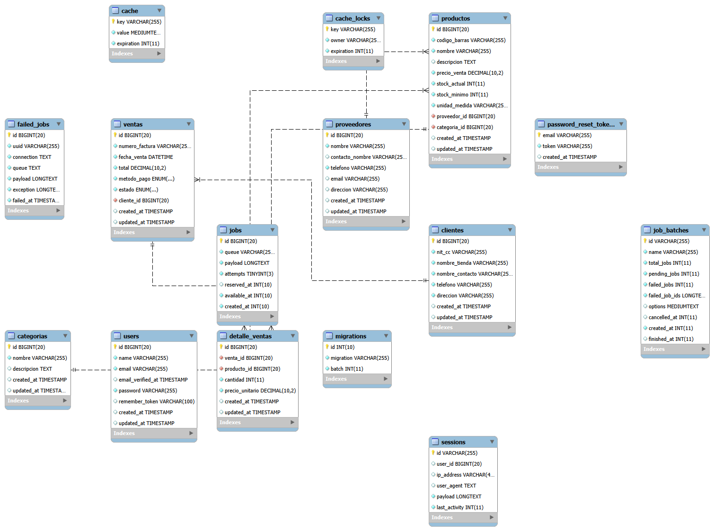

# 📦 Sistema de Gestión de Inventario y Ventas

## Distribuidora El Surtidor

Sistema web desarrollado con **Laravel**, diseñado para optimizar la gestión de inventario, productos, categorías, proveedores, clientes y ventas de la empresa **Distribuidora El Surtidor**.

El sistema permite controlar las existencias disponibles, registrar transacciones comerciales, administrar la información de los proveedores y clientes, además de generar reportes para apoyar la toma de decisiones empresariales.

---

# 📋 Tabla de Contenido

- [Descripción General](#-descripción-general)
- [Objetivos](#-objetivos)
- [Arquitectura del Sistema](#-arquitectura-del-sistema)
- [Modelo Entidad Relación (MER)](#-modelo-entidad-relación-mer)
- [Requisitos del Sistema](#-requisitos-del-sistema)
- [Instalación y Configuración](#-instalación-y-configuración)
- [Módulos Implementados](#-módulos-implementados)
- [Rutas Principales](#-rutas-principales)
- [Seguridad y Validaciones](#-seguridad-y-validaciones)
- [Tecnologías Utilizadas](#-tecnologías-utilizadas)
- [Autor](#-autor)

---

# 📝 Descripción General

El Sistema de Gestión de Inventario y Ventas fue desarrollado como una solución integral para la administración de productos y ventas de una empresa distribuidora.

Entre sus funcionalidades principales se encuentran:

- Gestión de productos.
- Gestión de categorías.
- Gestión de proveedores.
- Gestión de clientes.
- Registro y control de ventas.
- Actualización automática del inventario.
- Dashboard con información relevante.
- Exportación de datos.
- Reportes administrativos.

---

# 🎯 Objetivos

## Objetivo General

Desarrollar una aplicación web que permita gestionar eficientemente el inventario y las ventas de la empresa Distribuidora El Surtidor, garantizando la integridad y disponibilidad de la información.

## Objetivos Específicos

- Administrar productos y categorías.
- Gestionar proveedores y clientes.
- Registrar ventas y actualizar automáticamente el inventario.
- Controlar niveles mínimos de stock.
- Generar reportes para la toma de decisiones.
- Aplicar validaciones para garantizar la calidad de los datos.

---

# 🏗️ Arquitectura del Sistema

La aplicación fue desarrollada utilizando el patrón de arquitectura **MVC (Modelo - Vista - Controlador)**.

## Modelo (Model)

Gestiona la interacción con la base de datos utilizando **Eloquent ORM**.

### Modelos Principales

- Producto
- Categoria
- Proveedor
- Cliente
- Venta
- DetalleVenta

## Vista (View)

Implementada mediante:

- Blade Templates
- Tailwind CSS
- JavaScript

Características:

- Diseño responsive.
- Componentes reutilizables.
- Formularios dinámicos.
- Ventanas modales.
- Paginación y filtros.

## Controlador (Controller)

Gestiona la lógica de negocio y las solicitudes HTTP.

### Controladores Principales

- ProductController
- CategoriaController
- ProveedorController
- ClienteController
- VentaController

---

# 🗄️ Modelo Entidad Relación (MER)

## Diagrama MER

El siguiente diagrama representa la estructura de la base de datos utilizada por el sistema.

> Guarda la imagen que compartiste dentro de la carpeta `docs` con el nombre `MER.png`.

```text
docs/
└── MER.png
```

<p align="center">
    
</p>

---

## Entidades Principales

### Categorías

Permite clasificar los productos según su tipo.

| Campo | Tipo |
|---------|---------|
| id | BIGINT |
| nombre | VARCHAR(255) |
| descripcion | TEXT |
| created_at | TIMESTAMP |
| updated_at | TIMESTAMP |

---

### Proveedores

Información de los proveedores encargados del abastecimiento.

| Campo | Tipo |
|---------|---------|
| id | BIGINT |
| nombre | VARCHAR(255) |
| contacto_nombre | VARCHAR(255) |
| telefono | VARCHAR(255) |
| email | VARCHAR(255) |
| direccion | VARCHAR(255) |
| created_at | TIMESTAMP |
| updated_at | TIMESTAMP |

---

### Productos

Almacena la información de los productos disponibles para la venta.

| Campo | Tipo |
|---------|---------|
| id | BIGINT |
| codigo_barras | VARCHAR(255) |
| nombre | VARCHAR(255) |
| descripcion | TEXT |
| precio_venta | DECIMAL(10,2) |
| stock_actual | INT |
| stock_minimo | INT |
| unidad_medida | VARCHAR(255) |
| proveedor_id | BIGINT |
| categoria_id | BIGINT |

---

### Clientes

Contiene la información de los clientes registrados.

| Campo | Tipo |
|---------|---------|
| id | BIGINT |
| nit_cc | VARCHAR(255) |
| nombre_tienda | VARCHAR(255) |
| nombre_contacto | VARCHAR(255) |
| telefono | VARCHAR(255) |
| direccion | VARCHAR(255) |

---

### Ventas

Registra las transacciones comerciales realizadas.

| Campo | Tipo |
|---------|---------|
| id | BIGINT |
| numero_factura | VARCHAR(255) |
| fecha_venta | DATETIME |
| total | DECIMAL(10,2) |
| metodo_pago | ENUM |
| estado | ENUM |
| cliente_id | BIGINT |

---

### Detalle_Ventas

Tabla intermedia que almacena los productos vendidos en cada factura.

| Campo | Tipo |
|---------|---------|
| id | BIGINT |
| venta_id | BIGINT |
| producto_id | BIGINT |
| cantidad | INT |
| precio_unitario | DECIMAL(10,2) |

---

## Relaciones del Sistema

### Categorías → Productos

**1:N**

Una categoría puede contener múltiples productos.

### Proveedores → Productos

**1:N**

Un proveedor puede suministrar múltiples productos.

### Clientes → Ventas

**1:N**

Un cliente puede realizar múltiples compras.

### Ventas → Detalle_Ventas

**1:N**

Una venta puede contener varios productos.

### Productos → Detalle_Ventas

**1:N**

Un producto puede aparecer en múltiples ventas.

---

# ⚙️ Requisitos del Sistema

## Backend

- PHP 8.2 o superior
- Composer 2.x
- Laravel 12

## Frontend

- HTML5
- CSS3
- Tailwind CSS
- JavaScript

## Base de Datos

- MySQL 8+
- SQL Server (Opcional)

## Herramientas

- Git
- GitHub
- Node.js 18+
- NPM

---

# 🚀 Instalación y Configuración

## 1. Clonar el repositorio

```bash
git clone <https://github.com/theangel2004/Gesti-n-Inventario-y-Ventas>
cd <Gesti-n-Inventario-y-Ventas>
```

## 2. Instalar dependencias PHP

```bash
composer install
```

## 3. Configurar variables de entorno

```bash
cp .env.example .env
```

Editar el archivo `.env`:

```env
DB_CONNECTION=mysql
DB_HOST=127.0.0.1
DB_PORT=3306
DB_DATABASE=gestion_inventario
DB_USERNAME=root
DB_PASSWORD=
```

## 4. Generar clave de la aplicación

```bash
php artisan key:generate
```

## 5. Ejecutar migraciones

```bash
php artisan migrate
```

o

```bash
php artisan migrate:fresh --seed
```

## 6. Instalar dependencias frontend

```bash
npm install
```

## 7. Compilar recursos

```bash
npm run dev
```

## 8. Iniciar servidor

```bash
php artisan serve
```

La aplicación estará disponible en:

```text
http://127.0.0.1:8000
```

---

# 📊 Módulos Implementados

## Dashboard

**Ruta:** `/dashboard`

### Funciones

- Métricas principales del negocio.
- Acceso rápido a módulos.
- Resumen del inventario.
- Navegación a reportes.

---

## Gestión de Inventario

**Ruta:** `/inventario`

### Operaciones CRUD

#### Crear Producto

- Registro de nuevos productos.
- Validación de SKU único.
- Asociación de categoría y proveedor.

#### Consultar Producto

- Consulta dinámica mediante AJAX.
- Visualización en modal.

#### Editar Producto

- Actualización dinámica de información.

#### Eliminar Producto

- Confirmación de seguridad.

### Filtros

- Categoría.
- Estado de inventario.
- Stock mínimo.

### Exportación

- CSV.
- Excel.

### Paginación

- Conserva filtros activos.
- Mantiene búsquedas realizadas.

---

## Categorías

**Ruta:** `/categorias`

Permite administrar la clasificación de productos.

---

## Proveedores

**Ruta:** `/partners`

Permite administrar la información de proveedores.

---

## Clientes

Gestión completa de clientes registrados.

---

## Ventas

**Ruta:** `/ventas`

### Funciones

- Registro de ventas.
- Generación de facturas.
- Asociación de clientes.
- Actualización automática del inventario.

---

## Reportes

**Ruta:** `/reportes`

### Funciones

- Reporte de ventas.
- Reporte de inventario.
- Productos con stock bajo.
- Información estadística.

---

# 🛣️ Rutas Principales

| Método | Ruta | Nombre |
|---------|---------|---------|
| GET | /inventario | inventory |
| POST | /inventario | products.store |
| GET | /inventario/{id} | products.show |
| PUT | /inventario/{id} | products.update |
| DELETE | /inventario/{id} | products.destroy |

---

# 🔒 Seguridad y Validaciones

El sistema implementa:

- Validación de formularios.
- Restricción de valores negativos.
- Integridad referencial mediante claves foráneas.
- Protección CSRF de Laravel.
- Validación de SKU únicos.
- Control de stock mínimo.
- Validación de datos obligatorios.

---

# 🛠️ Tecnologías Utilizadas

| Tecnología | Uso |
|------------|-----|
| Laravel 12 | Framework Backend |
| PHP 8.2 | Lenguaje Backend |
| MySQL | Base de Datos |
| Tailwind CSS | Diseño UI |
| Blade | Motor de Plantillas |
| JavaScript | Interactividad |
| Eloquent ORM | Acceso a Datos |
| Git | Control de Versiones |
| GitHub | Repositorio |

---

# 👨‍💻 Autor

**Angel Correa Vega**

Tecnólogo en Análisis y Desarrollo de Software (ADSO) - SENA

---

# 📄 Licencia

Proyecto académico desarrollado con fines educativos para el programa ADSO del SENA.